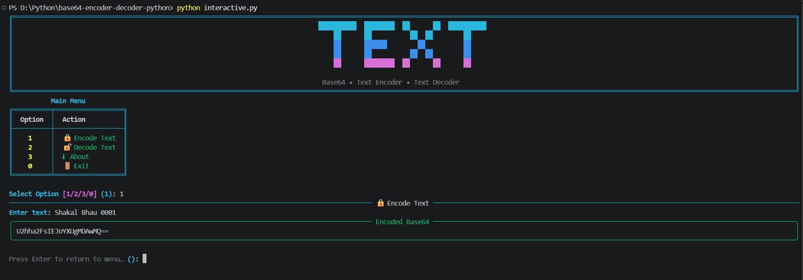
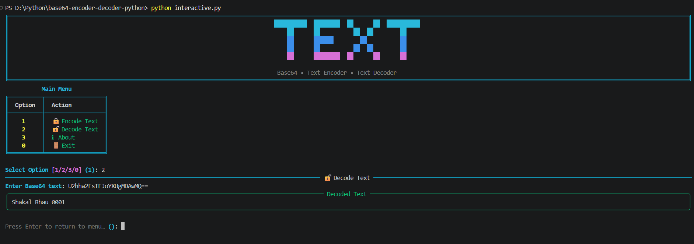
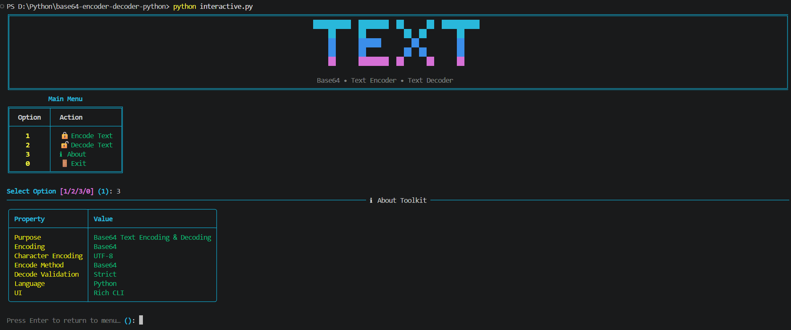
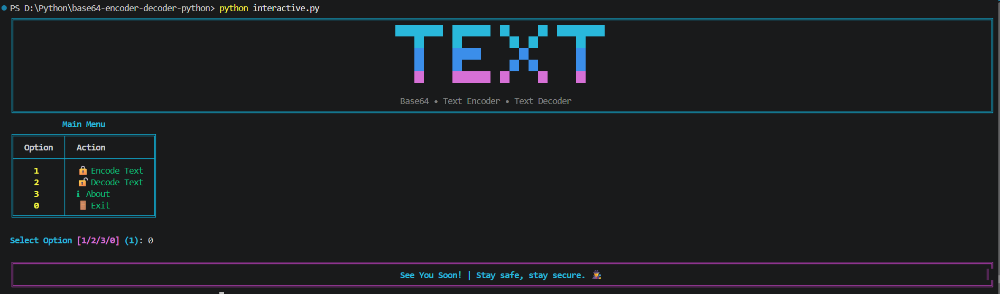

# 🔤 Base64-Text-Encoder-Decoder 🔐

A Python-based **Base64 Text Encoder & Decoder** Command Line Tool that lets you
**encode plain text into Base64** and **decode Base64 back into readable text**,
right from your terminal.
This CLI tool is built for **learning encoding concepts**, **CTF practice**, and
**quick text conversions**, combining a **simple no-dependency mode** with a
**rich, colorful interactive CLI**.

---

## 🧱 Project Structure

```bash
base64-text-encoder-decoder-python/
│
├── assets/             # Screenshots
├── main.py             # Basic CLI application
├── interactive.py      # Rich CLI Version
├── requirements.txt    # Project Dependancies
├── LICENSE             # Project license
└── README.md           # Project documentation
```

---

## ✨ Features

### 🔒 Encoding

- Encodes any UTF-8 text into **Base64**
- Simple, single-function conversion (`base64.b64encode`)
- Instant terminal output of the encoded string

### 🔓 Decoding

- Decodes Base64 text back into the original message
- Uses **strict validation** in the Rich CLI to catch malformed input
- Friendly error message on invalid Base64

### 🎨 Rich CLI Interface

- Colored terminal output with a custom banner
- Structured **About** table showing tool properties
- Styled panels for encode/decode results
- Better user experience and readability

### ⚡ Dual Mode Support

- 🧼 Basic CLI → Lightweight, no dependencies (`main.py`)
- 🎨 Rich CLI → Enhanced UI with colors, panels and menus (`interactive.py`)

---

## 🛠 Technologies Used

| Technology   | Purpose                   |
| ------------ | ------------------------- |
| **Python 3** | Core language             |
| **base64**   | Encoding & decoding logic |
| **Rich**     | Interactive CLI interface |

---

## ▶️ How to Run

### 1️⃣ Clone the repository

```bash
git clone https://github.com/ShakalBhau0001/base64-text-encoder-decoder-python.git
```

### 2️⃣ Enter the project directory

```bash
cd base64-text-encoder-decoder-python
```

### 3️⃣ Install Dependencies

```bash
pip install rich
```

**OR**

```bash
pip install -r requirements.txt
```

> ℹ️ The Basic CLI (`main.py`) needs **no external dependencies** — Rich is only required for `interactive.py`.

### 4️⃣ Running the Project

#### Basic CLI Version

```bash
python main.py
```

#### Rich Interactive Version

```bash
python interactive.py
```

---

## ▶️ Usage

### Basic CLI (`main.py`)

```bash
==========================================
        BASE64 - ENCODER | DECODER
==========================================

[1] Encode
[2] Decode
[3] Exit

Enter your choice: 1
Enter text: Hello World

Encoded Base64:
SGVsbG8gV29ybGQ=
```

```bash
Enter your choice: 2
Enter Base64 text: SGVsbG8gV29ybGQ=

Decoded text:

Hello World
```

### Rich Interactive CLI (`interactive.py`)

```bash
[1] 🔒 Encode Text
[2] 🔓 Decode Text
[3] ℹ About
[0] 🚪 Exit

Select Option: 1
Enter text: CTF Practice
```

---

## 📁 Supported Input

- **Text Type:** UTF-8 encoded strings
- **Encoding:** Standard Base64 (`base64.b64encode` / `base64.b64decode`)
- **Decode Validation:** Strict, in Rich CLI (`validate=True`)

> ⚠️ Invalid or malformed Base64 input will raise a clear error instead of a crash.

---

## ⚙️ How It Works

**1️⃣ Encoding**

- User text → encoded as **UTF-8 bytes**
- Bytes → converted to **Base64** using `base64.b64encode`
- Result decoded back to a printable string

**2️⃣ Decoding**

- Base64 string → validated and decoded using `base64.b64decode`
- Decoded bytes → converted back to a **UTF-8 string**
- Invalid Base64 raises a handled error instead of crashing the tool

---

## ⚠️ Common Errors

- **Invalid Base64 input** → Decode fails with a friendly error message
- **Non-UTF-8 decoded bytes** → Text can't be displayed as a string
- **Empty input** → Encoding/decoding an empty string returns an empty result

---

## 🌟 Future Enhancements

- File-based encode/decode (`--in-file` / `--out-file`)
- Support for URL-safe Base64 (`urlsafe_b64encode` / `urlsafe_b64decode`)
- Batch encode/decode for multiple lines at once
- Copy result directly to clipboard
- Argument-based (non-interactive) CLI mode for automation

---

## 📦 Related Projects

This repository focuses on a **specific encoding technique** implemented
as a **command-line (CLI) learning project**.

The goal of this project is to:

- Understand how Base64 encoding works at a practical level
- Practice decoding challenges commonly seen in **CTFs**
- Learn how simple CLI-based tools are structured

For more advanced, security-focused CLI tools, check out:

> 🔗 **[CLI Projects](https://github.com/stars/ShakalBhau0001/lists/cli-projects)**

---

## ⚠️ Disclaimer

> This project is intended for **educational and learning purposes only**.

> Base64 is an **encoding scheme, not encryption** — _it does not provide any confidentiality or security, and should never be used to protect sensitive data._

---

## 📸 Preview

### 1. **Encode**



### 2. **Decode**



### 3. **About**



### 4. **Exit**



---

## 🪪 Author

> **Creator: Shakal Bhau**

> **GitHub: [ShakalBhau0001](https://github.com/ShakalBhau0001)**

---

## ⭐ Support

If you like this project, consider giving it a ⭐ on GitHub!

---
